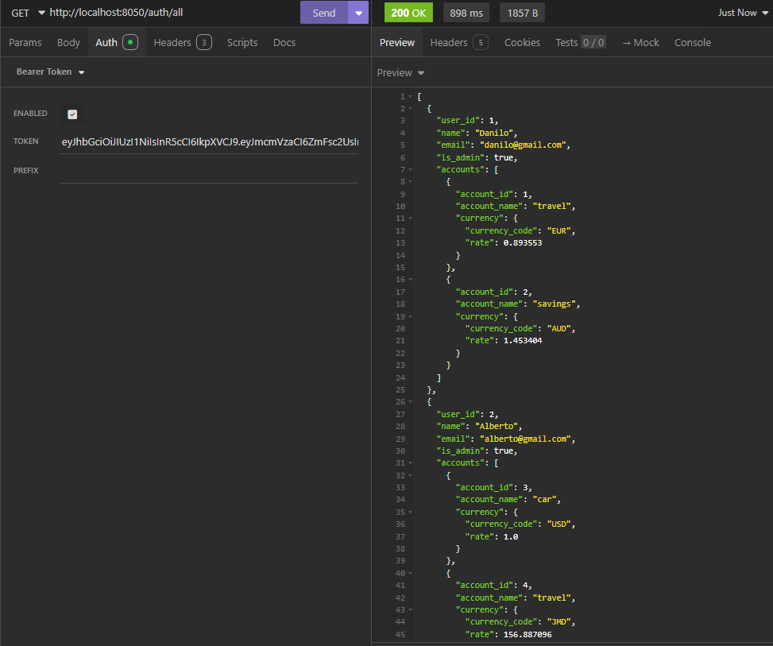
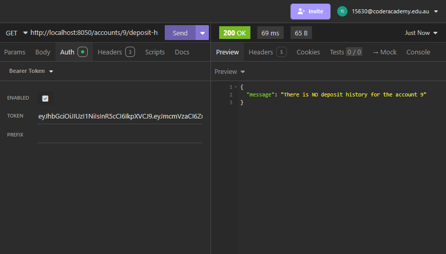
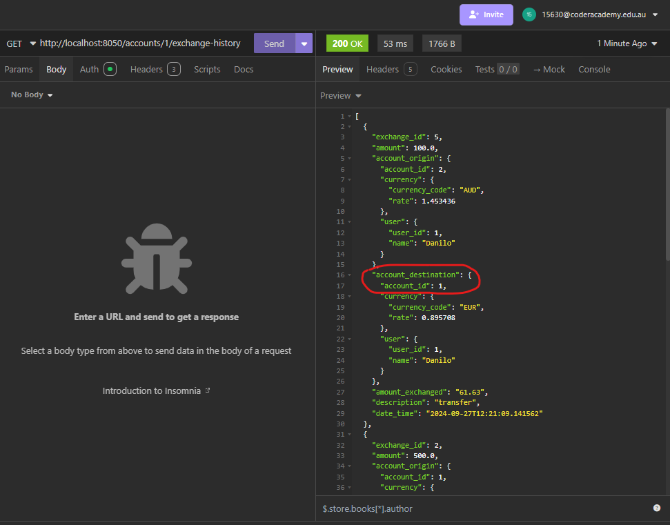
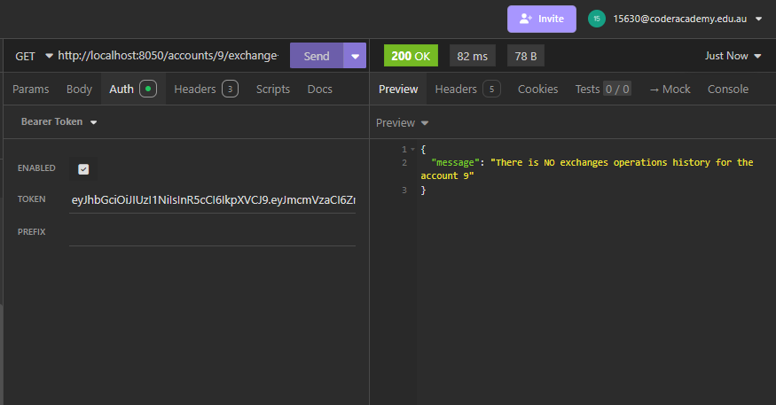

# T2A2 - API Webserver - Currency Exchange

## Application Overview
The developed application is a backend API with the sole purpose of facilitating currency exchange and account management more effectively. 
This application allows users to create multiple accounts, each assigned a unique currency (such as AUD, USD, EUR, GBP, and more). Users can deposit funds into their respective accounts, which hold only the designated currency. Additionally, users have the ability to transfer money between their accounts and to other users' accounts. If the accounts involved have different currencies, the application automatically performs the necessary currency conversions based on current exchange rates. 
## Integration with Third-Party Currency API:
The application relies on a third-party API (https://openexchangerates.org/) to fetch the most recent currency exchange rates. These rates are stored in a dedicated table within the database. To ensure that exchange rates are always up to date, the application includes a background task scheduled through the APScheduler library, which runs every hour. This task retrieves and updates the currency rates, allowing the system to consistently provide accurate conversions for users during transfers between accounts with different currencies.

By incorporating real-time exchange rates and automating currency conversions, the API enhances financial operations and ensures users always benefit from current exchange rates during their transactions.  
The features provided include:

### Account Management:

Allows the user to open and manage multiple accounts in various forms of currency. This will ensure that balance tracking and activities related to several accounts are tracked in one place.

### Real-Time Currency Exchange:

It fetches current and updated exchange rates from a third-party API. In this way, it ensures that the users will see the latest exchanges' rates before making any transaction in order to make better financial decisions.

### Deposit and Exchange Operations:

The users can easily deposit money and do currency exchange within the app. The amount exchanged calculated by the application based on the updated current rate in order to avoid any potential user-side errors.

### History of Transactions:

This application records every deposit and exchange made in its history, allowing users to review their financial activities. This feature encourages users to develop the habit of tracking their spending to budget effectively.

### Authorization and Security

The application puts in place secure authentication of users via JSON Web Tokens (JWT) so that only the respective owners have access to perform transactions on their accounts.

## How Application Solves the Problem

### Reduced Cost:

This would minimize dependence on expensive third-party services, as it provides direct access to real-time exchange rates and has the possibility of users managing their transactions through the app, thus minimizing transaction costs.

### Ease for the User:

Since a lot of people have accounts in different currencies, they are unable to handle them. This makes many errors and misunderstandings while financial planning are concerned. Keeping the management of currencies on one platform simplifies the procedures, which the user can handle without any confusion in his financial matters.

### Real-Time Data:

Real-time exchange rates enable users to decide on time, saving financial costs.

### Efficient Record Keeping:

By maintaining a record of detailed transaction history, the application enables the user to track his or her financial activities for a certain time period, thereby helping in better budgeting and financial planning.

### Security and Trust

With strong security measures in place, users are safer when it comes to the app for their financial needs.

## Problem Statement
There is quite a high burden of multiple currency financial management both for individuals and enterprises. Following are the key problems that one can find with objective references and statistics.

### Complexity of Currency Management:

According to a report by McKinsey & Company, small and medium-scale companies find hard to handle multiple currencies and this affects their financial activities.

### Inaccessibility to Real-Time Data:

World Bank records show that those businesses which cannot access real-time financial information are at a disadvantage and might lose 10% or more on currency transactions due to the lag in information.

### Record Keeping:

According to QuickBooks' survey, small business owners said that one of the major difficulties is to maintain accurate financial records, especially when confronted with numerous other currencies.

### Conclusion
This application approachingly answers critical problems in managing different currencies with objective statistics, showing the importance of such issues. The app enhances financial wellbeing with this easy-to-use and secure means of real-time data, transaction management, and account oversight. This is important in the global economy in which efficient currency management could mean much to individuals and businesses.

## Third-party services, packages and dependencies
Description of all the third-party services, packages, or dependencies used in the developed application:

### Flask
A micro web framework written in Python that is designed to keep to build web applications easily. It offers the most fundamental features of a web framework - routing, request handling, response generation making it lightweight and easy to extend.
Allows the user to provide the skeleton of the application by defining routes for several endpoints, for user authentication, currency management, or deposit operations. Its simplicity makes it an excellent choice for rapid development.
In this app Flask serves several keys roles:
* **Web Framework**
Flask provides the foundational structure for your web application, allowing you to define routes and handle HTTP requests and responses efficiently.
* **Routing**
It enables you to create specific endpoints (URLs) for various functionalities, such as retrieving currencies, managing accounts, and processing deposits and exchanges.
* **Request Handling**
Flask processes incoming requests, extracting data from HTTP methods (GET, POST, PATCH, DELETE) and passing it to the appropriate functions for processing.

### Flask-JWT-Extended
An extension for Flask that makes the implementation of JSON Web Tokens easier to implement for secure user authentication.
Provides decorators to protect routes, handle token creation and validation, and manage user sessions. Ensures sensitive endpoints can only be accessed by authenticated users, which enhances the security of the whole application.
Flask-JWT-Extended integrates smoothly with Flask, making it easy to set up and use in the application. It offers decorators like ```@jwt_required()``` to secure routes with minimal code.
The package provides features for creating, refreshing, and verifying JWTs. This includes handling expiration times for tokens, allowing users to maintain their session securely.

### SQLAlchemy
A powerful Object Relational Mapper (ORM) that provides a full suite of tools for interacting with relational databases in Python.
Used for defining data models, like User, Account, Exchange and Deposit as Python classes. SQL queries, data manipulation and schema migrations are possible via Python code.
SQLAlchemy allows defining Python classes that map directly to database tables. This means you can work with Python objects instead of writing raw SQL queries, making the code easier to maintain.
SQLAlchemy simplifies the process of creating, reading, updating, and deleting records in the PostgreSQL database.
With SQLAlchemy, it's possible to construct complex queries using a Python syntax. This allows easy filtering, ordering, and joining of tables without needing to write SQL manually.

### Marshmallow
A serialization/deserialization library that is used to easily convert complex datatypes to and from native Python datatypes.

* **Data Serialization**
Marshmallow converts complex data types, such as SQLAlchemy model instances, into native Python data types (like dictionaries). This process is essential for preparing data to be sent in JSON format to clients.  

* **Data Deserialization**
When receiving data from clients (e.g., through POST requests), Marshmallow validates and converts incoming JSON data into Python objects. This ensures that the data adheres to the expected schema before being processed or stored.

* **Schema Definition**
Marshmallow allows the user to define schemas that specify the structure and requirements of data. Specific rules can be set such as required fields, data types, and custom validation logic, making it easier to manage the data flow in the application.

* **Validation**
Marshmallow is also used to validate incoming data against the defined schemas, providing useful error messages if the data doesn't meet the specified criteria. This helps prevent invalid or malicious data from being processed.  

*Example:*  
In the currency application,  Marshmallow is used for the following tasks:

* When a user register an account it ensure that that account is registered with a unique currency code
* When a user deposits or exchange money, the incoming data is validated using a Marshmallow schema to ensure it includes the necessary fields (like amount and description).
* When retrieving transaction history, the data is serialized into a format suitable for sending back to the client.

### PostgreSQL
Open source relational database management system offering strong support for complex queries nd data integrity.
Provides the backbone storage for the application, maintaining all user accounts, transactions history, and currency data. It allows the application to support a multitude of users.
PostgreSQL stores all the application's data, including user accounts, financial transactions (deposits, exchanges), currency information, and account histories.
PostgreSQL ensures data integrity through features like constraints, foreign keys, and transactions.This helps maintain accurate and consistent data, preventing issues like orphaned records or invalid data states.

### Psycopg2
Python's adapter for PostgreSQL databases, offering functionality for the application to connect and interact with PostgreSQL databases.
Allows the execution of raw SQL queries and provides a robust method for handling database connections. Psycopg2 ensures that the application can manipulate databases effectively and securely.

### Python Dotenv
A module that loads environment variables from a .env file into the environment of the running application for better handling of the configuration settings in a secure manner.
Used to keep sensitive information, such as database credentials and API keys, out of source control. This practice reinforces security by not exposing sensitive data in the codebase.

### Requests
A simple HTTP library for Python, designed to make it easy to send HTTP requests and handle responses.
Requests is utilized to make API calls to the Open Exchange Rates API. This allows the application to retrieve up-to-date currency exchange rates, which are essential for performing accurate currency conversions and managing financial transactions across different currencies.  
Requests simplifies error handling and response parsing, as well as supports a number of different authentication methods that make it a useful tool for API interactions.

### bcrypt
A password hashing library which implements the bcrypt hashing algorithm to securely hash passwords.
It is used to secure users' passwords before putting it in the database. If there is a breach, bcrypt will prevent any user credentials from being exposed by hashing passwords, adding extra security.
* When a user creates an account or updates their password, bcrypt takes the plain-text password and generates a secure hash. This hash is a fixed-length string that represents the password but cannot be easily reversed to retrieve the original password.
* bcrypt automatically adds a unique salt to each password before hashing. A salt is a random string that is combined with the password to prevent attackers from using precomputed hash tables (rainbow tables) to crack passwords. Each password hash will be different, even if two users have the same password.
* Instead of storing plain-text passwords in the database, the application stores the hashed version. This means that even if the database is compromised, attackers will not have direct access to the users' actual passwords.
* When a user attempts to log in, the application retrieves the hashed password from the database and uses bcrypt to hash the input password again (with the same salt). It then compares the two hashes. If they match, the user is authenticated.
 
### APScheduler
A powerful Python library to run Python functions periodically. It allows the user to automate tasks, like updating the currency exchange rates on schedule, time of day or each hour/day. APScheduler periodically fetches updated currency exchange rates from the Open Exchange Rates API. This ensures that the application always has access to the latest financial data without requiring manual intervention. 

``` python
    scheduler = BackgroundScheduler()
    scheduler.add_job(func=update_exchange_rates,
    trigger="interval", minutes=60, args=[app])
    scheduler.start()
```
By integrating APScheduler, the application enhances its functionality by providing up-to-date currency information, which is essential for accurate financial transactions and reporting. This ultimately improves user experience and ensures reliability in currency management.

### Open Exchange Rates API
https://openexchangerates.org/

A third-party API providing current and historical foreign exchange rates.
Pulls new currency exchange rates for use in the application to carry out conversions accurately and keeps the user updated with the latest information on the currency market.
The value addition that the application will get from the use of the Open Exchange Rates API is huge, in terms of precision and reliability in the provision of updated information on currencies, which is great in financial management.

## PostgreSQL Advantages and Disadvantages

### Advantages of PostgreSQL
* **ACID Compliance**: PostgreSQL is fully compliant with ACID (Atomicity, Consistency, Isolation, and Durability). 
**Atomicity** ensures that all operations within a transaction are treated as a single unit for example if a user deposits funds, the system guarantees that the transaction either completes fully (reflecting the balance change) or is rolled back without partial updates.  
**Consistency** ensures that the database always remains in a valid state after each transaction, maintaining financial integrity.  
**Isolation** means that simultaneous transactions do not interfere with each other. This is crucial when multiple users are depositing funds, transferring between accounts, or exchanging currencies simultaneously, without causing conflicts.  
**Durability** guarantees that once a transaction is committed, the changes are permanent, even in the event of a system failure. This is especially important in a financial context, ensuring no lost data.

These aspects makes the app very reliable in financial transactions concerning the currency application, ensuring every transaction goes through 100% or is rolled back for consistency and integrity of data. This is an important aspect when deposits, exchanges, and transfers take place, since even minimal errors can mean huge losses in finances.

* **Relational Integrity and Handling of Complex Queries**: This is what PostgreSQL is particularly good at. It handles relational data structures, giving support for Foreign Keys, Joins, and Complex Queries. For instance, in the currency application, it allows defining relationships between the users, accounts, and operations-such as deposits and exchanges-for efficient data retrieval and complex reports about transactions or balances. In this Currency-exchanging app, PostgreSQL enables performing multi-table joins to retrieve a user's complete financial history across multiple accounts, operations, and even foreign exchanges.


* **JSONB support for flexible data structures**: Although PostgreSQL is strict for a relational model, it does support JSONB for semi-structured data storage or flexible data storage. This can be utilized for storing data that perfectly does not fit into the relational model, such as user-specific settings, metadata on exchange rates, or any evolving requirements that may require schema-less structure.

* **Scalability and Performance**: PostgreSQL handles large datasets and high transaction volumes efficiently, essential for a currency app that may grow in terms of users and transactions. Its ability to scale vertically (by adding hardware resources) and horizontally (through replication and sharding) means the database can grow along with the application.  
**Vertical scaling** allows the app to increase resources such as RAM or CPU for better performance. As the user base grows, the app can handle increasing amounts of data.  
**Horizontal scaling** is possible via replication, allowing the database to spread read/write operations across multiple instances. In a high-demand financial application, this is vital for improving response times and ensuring reliability.


* **Advanced Security Features**: In particular, PostgreSQL has high-level security features like user roles, fine-grained access control, and encryption through SSL to securely transmit data. Such features are also relevant to the currency exchange application in safeguarding sensitive information related to account balances, personal information, and financial activities from leakage, with the addition of compliance with laws concerning protection against data breaches.
For a currency exchange app dealing with sensitive financial information, protecting user data is crucial. PostgreSQL ensures secure communication over networks with SSL encryption, protecting against eavesdropping or tampering.  
**Role-based access control** helps in assigning privileges to different types of users, limiting who can access or modify sensitive data like balances, accounts, and exchange rates.

* **Free and Extensible**: Being open-source, PostgreSQL is free to use and very extensible. This would suit a project that might need some custom extensions or optimizations.
The PostgreSQL community regularly contributes new features, performance improvements, and security patches, keeping the system up-to-date and secure.

## Drawbacks of PostgreSQL
* **Complexity**: Postgres can be complex for new users to set up and use. It has a large set of features and options, which can make it overwhelming for beginners.

* **Slower performance**: When finding a query, Postgres due to its relational database structure has to begin with the first row and then read through the entire table to find the relevant data which cause performance issues. 
PotgreSQL performs slower especially when there is a large number of data stored in the rows and columns of a table containing many fields of additional information to compare.

* **Resource Intensive**: Compared to other lighter databases like MySQL or SQLite, the PostgreSQL database is a bit heavy. It requires more memory and CPU resources. This makes it unsuitable for running applications that need less power for computation.

* **Horizontal Scaling Challenges**: Although replication in general is supported by PostgreSQL, it is best suited for vertical scaling, where upgrades are made to the hardware of the server, rather than for horizontal scaling, where data is spread across numerous servers.
Large-scale applications that require very high scalability need advanced techniques like sharding, with PostgreSQL often tending to be pretty complicated and not fully natively supported without third-party solutions.

* **Lack of built-in tools**: Compared to some other database systems, Postgres does not have built-in tools for backups, monitoring and management. However, there are many third-party tools available that can provide these features.

## Object-Relational Mapping (ORM) Features and Functionalities
An ORM, or Object-Relational Mapping, provides an abstraction layer between an application and the database. This enables the developer to interact with the database using object-oriented programming techniques. In Python, this is done with ORMs like SQLAlchemy, used to simplify complex database operations into table classes and row objects.

### Mapping Database Tables to Classes
One of the core features of an ORM is its ability to map relational database tables to Python classes. Each row in a table is represented as an instance of the mapped class, while columns are represented as class attributes.  
*Example*
Consider a table Account in a database with fields like *id, account_name, currency_code, balance and date*. Here's how you would define this using SQLAlchemy:
``` python
class Account(db.Model):
    __tablename__ = "accounts"
    account_id = db.Column(db.Integer, primary_key=True)
    account_name = db.Column(db.String(20), nullable=False)
    currency_code = db.Column(db.String(3)),
    balance = db.Float, default=0)
    date_creation = db.Column(db.DateTime, default=datetime.now()) 

# creating a new account object
new_account = Account(currency_code="USD", balance = 1000, account_name="savings")
```
In this example the Account class maps to the accounts table.  
Each instance of Account represents a row in the table.  
The fields id, currency_code, account_name, balance and datetime in the class map to the respective columns in the table.

### Querying the Database with ORM
With an ORM, querying the database is intuitive and object-oriented. Instead of writing SQL queries, developers can query objects directly using the ORM's API.  

#### How to fetch all records
 Using SQLAlchemy, fetching all records from a table is straightforward. Each row in the database table will be represented as an object of the mapped class.
``` python
# Query all accounts from the Account table
statement = db.select(Account).all()
accounts = db.session.scalars(statement)
```
The above query is equivalent to this SQL query:
``` sql
SELECT * FROM accounts;
```
#### How to fetch data with condition and/or filter Records
To filter records based on specific conditions it's used the filter() or filter_by() method.
In this case we use the filter() method with multiple conditions.

``` python
# Fetch accounts where the currency is 'USD' balance greater than 1000
statement = db.select(Account).filter(Account.currency="USD", Account.balance > 1000)
usd_accounts = db.session.scalars(statement)

```
The above query is equivalent to
``` sql
SELECT * FROM accounts WHERE currency = 'USD' AND balance > 1000;
```

### Managing Relationships Between Tables
ORMs allows defining relationships between different tables using Python objects, abstracting the complexity of SQL JOIN statements. For example, a User can have multiple Account objects, which corresponds to a one-to-many relationship between User and Account.

#### Example of a One-to-Many Relationship:
```python
class User(db.Model):
    __tablename__ = "users"

    user_id = db.Column(db.Integer, primary_key=True)
    name = db.Column(db.String(20), nullable=False)     
    email = db.Column(db.String, nullable=False, unique=True)      
    password = db.Column(db.String, nullable=False)     
    is_admin = db.Column(db.Boolean, default=False)

    accounts = db.relationship("Account", back_populates="user")

    class Account(db.Model):
    __tablename__ = "accounts"
    account_id = db.Column(db.Integer, primary_key=True)
    account_name = db.Column(db.String(20), nullable=False)
    balance = db.Column(db.Numeric(precision=10, scale=2), default=0) 
    date_creation = db.Column(db.DateTime, default=func.now())

    user_id = db.Column(db.Integer, db.ForeignKey("users.user_id"), nullable=False)
    
    user = db.relationship("User", back_populates="accounts")
```

In the above example
- User can have many Accounts objects but each Account belongs to a single User.
- The user_id column in Account is a **foreign key** that links back to the User table.
- The relationship() function creates a reference between the two tables, enabling to retrieve the data easily.

#### Example of query of how to retrieve related data
``` python
# Query to retrieve all accounts of a specific user
statement = db.session.query(
            Account.account_id, Account.account_name
        ).join(User, Account.user_id == User.user_id)

        user_accounts = statement.filter(User.user_id == some_user_id).all()
```
- Select: Retrieves the account_id and account_name from the Account table.
- Join: Combines Account with User based on matching user_id values.
- Filter: Limits the results to accounts where the User.user_id matches the specified some_user_id.
- All: Executes the query and returns all matching records.

### Creating and Updating Records
ORMs allows easily inserting new records or updating existing ones, simplifying the database manipulation process.

#### Example of Inserting records
``` python
# Create a new Account
new_account = Account(account_name = "SAVINGS", currency_code="EUR", balance=2000.0)
# Add to session and commit
session.add(new_account)
session.commit()
```
#### Example of Updating records
#### Fetch an account
```python
account = session.query(Account).filter_by(id=1)
# update name
accouunt.account_name="Euro-trip"
```
#### Deleting records
Deleting records from a database is as simple as querying for the record and passing it to the delete() method.

#### Example on how to delete a record
``` python
# Fetch the account to be deleted
account = session.query(Account).filter_by(id=1)

# Delete and commit the transaction
session.delete(account)
session.commit()
```
This removes the record from the database permanently.

### Transaction Management
Among the main advantages of an ORM is the fact that they come with built-in transaction management. Support for transaction management within ORMs such as SQLAlchemy is among the most important features, ensuring data integrity and coherence over various database operations. Particularly, ORMs have native capabilities of committing and rolling back a transaction. That makes them efficient in taking care of the so-called complex data interactions.
It is standard in SQLAlchemy to handle transaction management via a session object. Here's how it works:

1. **Creating a Session**: A session is an object that is the major interface to the database and transaction management. You create a session using a sessionmaker.

2. **Adding Objects**: You can add objects to the session. These objects are not written straightaway to the database but are, instead, staged for insertion.

3. **Committing a Transaction**: At the time of issuing session.commit(), whatever changes have taken place in the session are written by SQLAlchemy to the database. If this commit goes through successfully, then that transaction is complete and all changes are permanent.

4. **Rolling Back a Transaction**: i there is an error at any point in the course of the transaction, you are able to roll back all changes that have been made in this session by using session.rollback(). This reverts the database back to its previous state before the transaction started.

### Advanced Transaction Management Features
- **Savepoints**: SQLAlchemy supports savepoints, which allow you to roll back to a certain point in a transaction rather than rolling back the whole transaction. That's useful during complex operations where you might want to do partial undoing. 
- **Concurrency Control:** SQLAlchemy provides various mechanisms that help it to cope with concurrent transactions and resolve conflicts that may arise between these transactions.
- **Context Management**: Using Python's with statement, a context can be created for a session; this automatically handles the commit and rollback behavior in a much cleaner and easier-to-manage way.
like

### Performance Optimization: Lazy Loading
A common design pattern in many ORMs, including SQLAlchemy, is lazy loading. Instead of loading related data immediately, it defers the load until actually needed. This can reduce memory usage quite drastically and improve application response times on larger data sets or complex object relationships.  
Lazy Loading Key Details:
- **Lazy Loading of Data**: In the practice of lazy loading, entities are not fetched from the database until it is absolutely accessed.
- **Reduced Memory Consumption**: Lazy loading reduces memory usage, particularly on entities with a lot of relationships. It will only load the data that needs to be used. This comes in quite handy when there are hundreds or even thousands of users within an application, or when dealing with massive amounts of data.
- **Smart Querying**: Lazy loading can lead to better querying patterns, where instead of executing one big join query that retrieves all related data at once, separate queries are executed only when needed. This means only the relevant data is fetched from the database.
like
 
### Automatic Schema Creation
Most ORM frameworks, including SQLAlchemy, support the generation of schema automatically, enabling the developer to create and manage database schemas directly from the application code. In this way, the development process is eased, becoming much simpler to evolve the database schema with the application, without having to write SQL scripts manually.
Key Facts of Automated Schema Generation:

- **Model definition**: If one uses ORM, then database table representations become classes (models). Each class defines schema: table names, column names, data types, constraints, and relationships.

- **Database Initialization**: Using auto-schema generation, initialization of the database becomes very easy. One calls a method, such as create_all from SQLAlchemy, and the ORM will provide the appropriate SQL to create the tables given the models that you have defined.

- **Data types and Constraints**: ORM automatically maps Python types to database types. This includes the definition of constraints such as primary keys, foreign keys, unique constraints, and fields being nullable according to the model definition.  

*Example*
``` python
class Exchange(db.Model):
    __tablename__ = "exchanges"
    exchange_id = db.Column(db.Integer, primary_key=True)
    amount = db.Column(db.Numeric(precision=10, scale=2), nullable=False)       
    amount_exchanged = db.Column(db.Float), nullable=False)  
    description = db.Column(db.String(100))
    date_time = db.Column(db.DateTime, default=datetime.now())

    # foreign keys
    from_account_id = db.Column(db.Integer, db.ForeignKey("accounts.account_id", ondelete='SET NULL'))
    to_account_id = db.Column(db.Integer, db.ForeignKey("accounts.account_id", ondelete='SET NULL'))
```

- **Development Efficiency**: Automatic schema creation right out of the box at the start of development pivots the speed to prototype and iterate on a database design. A developer can quickly change their models and immediately see the result in the database sans cumbersome migration steps.

## Project’s models (relationships)
The project involves several models that have specific relationships with each other.   
Here's a breakdown of the models and their relationships:

### User and Account (One-to-Many Relationship)
A user can have multiple accounts, each storing individual balances and unique currency, allowing interaction with Deposits and Exchanges tied to specific accounts. This is represented as a one-to-many relationship between User and Account. 


**user.py**

``` python
class User(db.Model):
    __tablename__ = "users"
    user_id = db.Column(db.Integer, primary_key=True)
    # Relationship with account
    accounts = db.relationship("Account", back_populates="user")
```

**account.py**

``` python
class Account(db.Model):
    __tablename__ = "accounts"
    account_id = db.Column(db.Integer, primary_key=True)
    # User Foreign key
    user_id = db.Column(db.Integer, db.ForeignKey("users.user_id"), nullable=False)
    # Relationship with user
    user = db.relationship("User", back_populates="accounts")
```
### QUERY
#### Retrieve all accounts for a user:
``` python
user_accounts = (
    db.session.query(Account)
    .join(User)
    .filter(User.user_id == user_id)
)
```

### Account and Deposit (One-to-Many Relationship)
Accounts can have many deposits, but each deposit is linked to a single account. This facilitates tracking transaction history for each user.

**deposit.py**

``` python
class Deposit(db.Model):
    __tablename__ = "deposits"
    deposit_id = db.Column(db.Integer, primary_key=True)
    # Account Foreign key
    account_id = db.Column(db.Integer, db.ForeignKey("accounts.account_id"))
    # Relationship with account
    account = db.relationship("Account", back_populates="deposits")
```

**account.py**

``` python
    __tablename__ = "accounts"
    account_id = db.Column(db.Integer, primary_key=True)
    # Relationship with deposit
    deposits = db.relationship("Deposit", back_populates="account")
```

#### Get all deposits for a specific account:
```python
account_deposits = (
    db.session.query(Deposit)
    .join(Account)
    .filter(Account.account_id == account_id)
)
```
### QUERY
### Account and Currency (Many-to-One Relationship)
Multiple accounts can be associated with the same currency, but each account is tied to one specific currency. This ensures currency consistency across all transactions within an account.

**account.py**

``` python
class Account(db.Model):
    __tablename__ = "accounts"
    account_id = db.Column(db.Integer, primary_key=True)
    # Currency Foreign key
    currency_code = db.Column(db.String(3), db.ForeignKey("currencies.currency_code"), nullable=False)
    # Relationship with currency
    currency = db.relationship("Currency", back_populates='account')
```

**currency.py**

``` python
class Currency(db.Model):
    __tablename__ = "currencies"
    currency_code = db.Column(db.String(3), primary_key=True)
    # Relationship with account
    account = db.relationship('Account', back_populates='currency')
```
### QUERY
#### Find all accounts with a specific currency
``` python
currency_accounts = (
    db.session.query(Account)
    .join(Currency)
    .filter(Currency.currency_code == 'EUR')
)
```

### Account and Currency Validation
The validation for the currency_code in the AccountSchema ensures that a user cannot have more than one account with the same currency.

``` python
class AccountSchema(ma.Schema):
    @validates("currency_code")
    def validates_currency_code(self, currency_code):
        user_id = get_jwt_identity()
        existing_account = (
            db.session.query(Account)
            .filter(Account.currency_code == currency_code, Account.user_id == user_id)
            .first()
        )
        if existing_account:
            raise ValidationError(f"An account with the currency {currency_code} already exists for user {user_id}.")
```


###  Account and Exchange (One-to-Many Self-Referential Relationship)
An exchange involves transferring currency between two accounts. The Exchange model refers to Account twice, once for the source account (from_account_id) and once for the destination account (to_account_id).  
Account has two foreign key relationships to the Exchange model:

- exchange_from: All the exchanges where the account is the source account (from_account_id).
- exchange_to: All the exchanges where the account is the destination account (to_account_id).  

Exchange joins two accounts:
- from_account_id: The account from which the funds are transferred.
- to_account_id: The account to which the funds are transferred.
This design makes it possible for an account to participate in many exchanges as both a sender and receiver.

In the case of self-referential relationships like this, an account can both send and receive exchanges through the Exchange table which acts as the "join" table.

**account.py**
``` python
class Account(db.Model):
    __tablename__ = "accounts"
    account_id = db.Column(db.Integer, primary_key=True)
    # Relationship with exchange
    exchange_from = db.relationship("Exchange", foreign_keys='Exchange.from_account_id', back_populates="account_origin")
    exchange_to = db.relationship("Exchange", foreign_keys='Exchange.to_account_id', back_populates="account_destination")
```
**exchange.py**
``` python
class Exchange(db.Model):
    __tablename__ = "exchanges"
    exchange_id = db.Column(db.Integer, primary_key=True)
    
    # Account Foreign keys
    from_account_id = db.Column(db.Integer, db.ForeignKey("accounts.account_id", ondelete='SET NULL'))
    to_account_id = db.Column(db.Integer, db.ForeignKey("accounts.account_id", ondelete='SET NULL'))

    # Relationship with account
    account_origin = db.relationship("Account", foreign_keys=[from_account_id], back_populates="exchange_from")
    account_destination = db.relationship("Account", foreign_keys=[to_account_id], back_populates="exchange_to")
```
To ensure that the Exchange table retains the transaction record when an Account is deleted, the foreign key constraints for both from_account_id and to_account_id in the Exchange table are allowed to store **NULL** values **(ondelete='SET NULL')**. This way, if an account is deleted, the corresponding fields in the Exchange table will be set to NULL, preserving the transaction history.  

These relationships are implemented using SQLAlchemy with foreign keys and relationship definitions, ensuring proper data structure and referential integrity in the system.

### QUERY
#### List all exchanges where an account is the sender (source)
``` python
sender_exchanges = (
    db.session.query(Exchange)
    .join(Account, Exchange.from_account_id == Account.account_id)
    .filter(Account.account_id == account_id)
)
```
#### List all exchanges where an account is the receiver (destination):
``` python
receiver_exchanges = (
    db.session.query(Exchange)
    .join(Account, Exchange.to_account_id == Account.account_id)
    .filter(Account.account_id == account_id)
    .all()
)
```


## Data normalization
A plan for designing a normalized database focuses on organizing data efficiently, reducing redundancy, and ensuring data integrity. The normalization process typically follows several normal forms (NF), each with specific rules
Here’s a step-by-step plan for achieving normalized database relations:

### Identify Entities (Tables)
- **User**: User: Stores information about users (e.g., ID, name, email).
- **Account**: Tracks user accounts (e.g., ID, balance, currency).
- **Currency**: Holds currency exchange rates (e.g., code, rate, last update).
- **Deposit**: Logs deposits made into accounts (e.g., deposit ID, account ID,
- **Exchange**: Tracks currency exchanges between accounts (e.g., from_account_id, to_account_id, exchange_rate).

### First Normal Form (1NF)
A table is in 1NF if:

* All columns contain atomic values (no repeating groups or arrays).  
* Each column contains values of a single type.
* Each record is unique.  

### Second Normal Form (2NF)
A table is in 2NF if:

* It is in 1NF.  
* All non-key attributes are fully functional dependent on the primary key (no partial dependencies).

### Third Normal Form (3NF)
A table is in 3NF if:

* It is in 2NF.
* There are no transitive dependencies (non-key attributes should not depend on other non-key attributes).


### Normalization Steps:

#### User Table:
* user_id (Integer, Primary Key) - Unique identifier for each user.
* name (String, Nullable=False) - Name of the user.
* email (String, Nullable=False, Unique=True) - Email address of the user, must be unique.
* password (String, Nullable=False) - Password for the user account.
* is_admin (Boolean, Default=False) - Indicator of whether the user has admin privileges.

##### 1NF:
* All attributes (user_id, name, email, password, is_admin) are atomic.
* The primary key (user_id) ensures that each record is unique.

##### 2NF:
* All non-key attributes (name, email, password, is_admin) are fully dependent on the primary key (user_id).

##### 3NF:
* There are no transitive dependencies.
* name, email, password, and is_admin do not depend on each other and only depend on user_id.


#### Account Table:
* account_id (Primary Key) - Unique identifier for each account.
* currency_code (Foreign Key referencing Currency.currency_code) - The currency * associated with the account.
* balance (Decimal) - Current balance of the account.
* date_creation (DateTime) - The date the account was created.
* user_id (Foreign Key referencing User.user_id) - The user who owns the account.

##### 1NF:
* Each attribute is atomic (no repeating groups).
* The primary key (account_id) ensures that each record is unique.

##### 2NF:
* All non-key attributes depend on the primary key.
* currency_id, balance, date_creation, and user_id all depend on account_id.

##### 3NF:
* There are no transitive dependencies; currency_code, balance, date_creation, and user_id do not depend on each other and only depend on account_id.
 
#### Deposit Table
* deposit_id (Integer, Primary Key) - Unique identifier for each deposit.
* amount (Numeric, Nullable=False) - The amount of the deposit.
* description (String) - A description of the deposit.
* date_time (DateTime, Default=func.now()) - The date and time when the deposit was made.
* account_id (Integer, Foreign Key referencing Account.account_id) - The account associated with the deposit.

###### 1NF:
* All attributes (deposit_id, amount, description, date_time, account_id) are atomic.
* The primary key (deposit_id) ensures that each record is unique.

##### 2NF:
* All non-key attributes depend on the primary key (deposit_id).
* account_id, amount, description, and timestamp are all dependent on deposit_id.

##### 3NF:
* There are no transitive dependencies; amount, description, date_time, and account_id do not depend on each other and only depend on deposit_id.

#### Exchange Table
* exchange_id (Primary Key)
* from_account_id (Foreign Key referencing Account.account_id)
* to_account_id (Foreign Key referencing Account.account_id)
* amount
* amount_exchanged
* exchange_rate
* timestamp

##### 1NF:
* All attributes are atomic, and exchange_id is unique.

##### 2NF:
* All non-key attributes depend on the primary key (exchange_id).
* from_account_id, to_account_id, amount, amount_exchanged, exchange_rate, and timestamp all depend on exchange_id.

##### 3NF:
* There are no transitive dependencies.

#### Currency Table
* currency_code (String, Primary Key) - Unique code representing the currency (e.g., USD, EUR).
* rate (Float, Nullable=False) - Current exchange rate of the currency.
* base_code (String, Nullable=False) - The base currency code against which the rate is compared.
* last_update (DateTime, Default=func.now()) - The last time the exchange rate was updated.

##### 1NF:
* currency_code, rate, base_code, and last_update are all atomic values.
* The primary key (currency_code) ensures that each record is unique.

##### 2NF:
* rate, base_code, and last_update are all dependent on the primary key (currency_code).

##### 3NF:
* rate, base_code, and last_update do not depend on each other; they only depend on currency_code.

### Comparison on how the table Exchange would look like in other levels of normalization.

In the pre-normalized schema, the Exchange table contains redundant currency_code information directly:  
### Before normalization:

**Exchange:**  
* exchange_id INT PRIMARY KEY,
* amount FLOAT,
* description VARCHAR,
* from_currency_code CHAR(3),  -- Redundant currency code
* to_currency_code CHAR(3),    -- Redundant currency code
* from_account_id FK (REFERENCES accounts(account_id))  
* to_account_id FK (REFERENCES accounts(account_id))
* date_time TIMESTAMP

In this schema, from_currency_code and to_currency_code are directly stored in the Exchange table. This redundancy can lead to issues if currency information changes or if it's not synchronized with the Account table.

### After Normalization (3NF):  

**Exchange:**  
In the normalized schema, the Exchange table does not store currency codes directly. Instead, it references the Account table, which stores the currency information:

* exchange_id INT PRIMARY KEY,
* amount FLOAT,
* description VARCHAR,
* from_account_id FK (REFERENCES accounts(account_id))
* to_account_id FK (REFERENCES accounts(account_id))
* date_time TIMESTAMP

In the normalized schema, the currency information is stored in a separate currencies table, which is referenced by the accounts table through the currency_code foreign key. 

**Accounts:**
* account_id INT PRIMARY KEY,
* balance FLOAT,
* user_id FK (REFERENCES users(user_id)), -- Reference to accounts table
* currency_code FK (REFERENCES currencies(currency_code))  -- Reference to currencies table

### Benefits of This Structure
By introducing the currencies table and referencing it in the accounts table, normalization principles are applied effectively. This structure enhances data integrity and simplifies management, making it a robust design for handling currency exchanges.
* Reduced Redundancy: Currency codes are only stored in the currencies table, avoiding duplication.
* Consistency: Changes to currency codes or rates are managed in one place.


### Comparison on how the Account table would look like in other levels of normalization.

### Before normalization
**Account table**
* account_id INT PRIMARY KEY,
* currency_code CHAR(3),           -- Redundant currency code
* balance DECIMAL(10, 2),
* user_name VARCHAR(255),           -- Redundant user information
* user_email VARCHAR(255)           -- Redundant user information

The currency_code is redundantly stored in the accounts table.  
Contains redundant user information such as user_name and user_email, which can lead to data anomalies if user details change.

#### After normalization (3NF)

**Account table**
* account_id INT PRIMARY KEY,
* balance FLOAT,
* user_id FK (REFERENCES users(user_id)), -- Reference to users table
* currency_code FK (REFERENCES currencies(currency_code))  -- Reference to currencies table

**User table**
* user_id INT PRIMARY KEY,
* user_name VARCHAR,
* user_email VARCHAR,
* password_hash VARCHAR,
* is_admin BOOL

The currency_code is retained in the accounts table as a foreign key referencing the currencies table. This maintains the relationship without redundancy since the currency_code directly relates to the account.
The users table is created to store user-related information, ensuring that changes to user information only occur in one place.

### Benefits of This Structure
* Data Integrity: The foreign key relationships maintain integrity between the accounts, users, and currencies tables.
* Reduced Redundancy: Currency codes are only stored in the currencies table, but the relationship is established through the accounts table without duplicating data.
* Consistency: Updates to currency information are managed in one place, ensuring that all accounts reference the correct currency data.

## IDENTIFY AND DESCRIBE the application’s API endpoints
### auth_controller.py

**Get All Users Endpoint**
**@auth_bp.route("/all")**

* HTTP Verb: GET

* Route Path: /auth/all

* Authorization:

* Requires a valid JWT token in the Authorization header.

* The user must have admin privileges (**is_admin must be True**).


This endpoint retrieves all user records from the database.
It utilizes the authorize_as_admin() function to check if the authenticated user has admin privileges.
If the user is authorized, the endpoint executes a database query to select all entries from the User table.

  
Successful Response (200 OK): Returns a JSON array containing all user records, structured based on the users_schema, including each account linked to the user and each currency linked to the account itself.

  
If the user is not an admin, it raises a Forbidden error with a message indicating that the resorce is denied.

**User Registration Endpoint**
**@auth_bp.route("/register", methods=["POST"])**

- HTTP Verb: POST

- Route Path: /auth/register

- Request Body:

JSON object containing:
- name: User's name (string, required)
- email: User's email address (string, required)
- password: User's password (string, required)


This endpoint allows new users to register by validating their input and securely hashing their passwords.
The **user_schema_validation** is used to validate the incoming data.
A new user record is created in the User model with the provided details.
The user is added to the database session and committed.

If successful, the new user is added to the User table.
If there are integrity issues (like unique constraints or not null violations), appropriate error messages are returned.

  
Successful Response (200 OK): Returns a a message informing of the creation of the new user along with newly created user schema.

  
409 Conflict (Unique Violation)

  
400 Bad Request (Not Null Violation) AND validation error

**User Login Endpoint**  
**@auth_bp.route("/login", methods=["POST"])**

* HTTP Verb: POST

* Route Path: /auth/login

* Request Body:

Expects a JSON object containing:
* email: User's email address (string, required)
* password: User's password (string, required)


This endpoint manages user authentication by validating the provided email and password.
It retrieves the user from the User table based on the provided email.
If the user exists, it verifies the password against the stored hashed password.
Upon successful authentication, it generates a JWT token.

  
Successful Response (200 OK): If the email exists, it performs a query to fetch the user record.
The hashed password is checked for validity using bcrypt library.
JWT token is generated.

  
404 Not Found (Email Not Found):

  
401 Unauthorized (Invalid Password)

**Update User Endpoint**
**@auth_bp.route("/users", methods=["PUT", "PATCH"])**

* HTTP Verb: PUT or PATCH

* Route Path: /auth/users

* Authorization: Requires a valid JWT token in the Authorization header.

* Request Body:

Expects a JSON object containing any of the following optional fields:
* name: User's name (string, optional)
* email: User's email address (string, optional)
* password: User's password (string, optional; if provided, it will be hashed)


This endpoint allows authenticated users to update their own records in the database.
It ensures that users can only modify their information by retrieving their user ID from the JWT.
The incoming JSON data is validated, allowing partial updates (i.e., only the fields provided will be updated).
A query is performed to find the user based on the user ID extracted from the JWT.
If the user is found, their fields are updated with the provided data.
If a new password is included in the request, it is securely hashed before updating.

  
Successful Response (200 OK): Returns a message of succesfully updating along with the user schema containing the updates.

  
409 Conflict (Email Already Registered)

**Delete User Endpoint**
**@auth_bp.route("/", methods=["DELETE"])**

* HTTP Verb: DELETE
* Route Path: /auth/users
* Authorization: Requires a valid JWT token in the Authorization header.

This endpoint allows authenticated users to delete their own accounts.
Users can only delete their accounts if they have no associated accounts with a positive balance.

**Account Balance Check:**

A query is performed to check if the user has any accounts with a balance greater than zero.
If such accounts exist, the user will not be allowed to delete their account, and details of the accounts will be returned.
Before to get deleted the account's balance must be transfered to another user's account.

**User Deletion**:

If no accounts with a positive balance are found, the user's record is retrieved based on the user ID extracted from the JWT. If the user exists, their record is deleted from the database, along with any associated accounts through a **cascade delete mechanism**.

  
Successful Response (200 OK): message of succesfully deleting

  
400 Bad Request (Accounts with Positive Balance):
Returns a 400 error message along with a list of accounts with positive balance linked to the user.

### Account controller

**Count Accounts Grouped by User Endpoint**
**@account_bp.route("/all")**

* HTTP Verb: GET
* Route Path: /account/all
* Requires a valid JWT token in the Authorization header.
* The user must have admin privileges (**is_admin must be True**).


This endpoint allows only authenticated users with admin privileges to retrieve the count of all accounts grouped by user.  
It checks whether the requester has admin privileges using the authorize_as_admin() function.

A SQL query is executed to retrieve the user ID, user name, and count of accounts associated with each user:
```sql
SELECT User.user_id, User.name, COUNT(Account.account_id) 
FROM User
JOIN Account ON User.user_id = Account.user_id 
GROUP BY User.user_id, User.name;
```

  
Successful Response (200 OK): Return the number of accounts for each user.

  
403 Forbidden (Not Authorized): it raises a Forbidden error with a message indicating that the resorce is denied.

**Get Accounts Endpoint**

* HTTP Verb: GET
* Route Path: /account/
* Authorization: Requires a valid JWT token in the Authorization header.

This endpoint retrieves and returns all accounts associated with the currently authenticated user. The user ID is obtained from the JWT token using get_jwt_identity().
It ensures that only authenticated users can access their own account information through the use of JWT (JSON Web Token).


  
Successful Response (200 OK): return a list of the accounts through the accounts_schema that belong to the current authenticated user.

**Get Specific Account Info Endpoint**
* HTTP Verb: GET
* Route Path: /account/<int:account_id>
* Authorization: Requires a valid JWT token in the Authorization header.
* The authorization is handled by the @check_account_user decorator, which verifies that the account belongs to the current user.

This endpoint retrieves the details of a specific account identified by the account_id parameter.
It ensures that the authenticated user is authorized to access the specified account.


  
Successful Response (200 OK): return the account_id info

  
403 Forbidden (Not Authorized): it raises a Forbidden error with a message indicating that the resorce is denied.

  
Error Response (404 Not Found): when the account_id doesn't exist it's raised a 404 error.

**Create Account Endpoint**
* HTTP Verb: POST
* Route Path: /accounts/
* Authorization: Requires a valid JWT token in the Authorization header.

The request expects a JSON object containing the following fields:

* account_name (string, required): The name of the account.
* balance (decimal, optional): The initial balance of the account is set to zero by default. An account ca be created without deposit any money.
* currency_code (string, required): The currency in which the account operates.

This endpoint allows authenticated users to create a new account.
It retrieves the authenticated user's user_id from the JWT token.
Validates the input using the account_schema.
Ensures that required fields are provided.
Capitalizes the account name for uniformity.
Attempts to create a new account for the user in the database.

Account Creation:
A new Account object is created based on the input data and is linked to the authenticated user.

  
Successful Response (201 Created): returns the newly created account

  
400 Bad Request (Missing Required Fields). Violation of NOT NULL constraints

  
400 Bad Request (Validation error). The validation for the currency_code in the AccountSchema ensures that a user cannot have more than one account with the same currency.
It perform this query to retrieve ay account with a specific currency_code. If an account already have that currency, it return an error message.

```sql
SELECT *
FROM account
WHERE currency_code = '<currency_code>'
AND user_id = <user_id>
```

**Update Account Endpoint**

* HTTP Verb: PATCH
* Route Path: /accounts/<int:account_id>
* Authorization: Requires a valid JWT token in the Authorization header.
* The @check_account_user decorator ensures that the user is authorized to update the specified account by verifying the account_id belongs to the authenticated user.

The request expects a JSON object with the optional fiels that need to be updated:
* account_name (string, optional): The new account name.

The endpoint allows for partial updates to an account, identified by the account_id parameter.
The @jwt_required() decorator ensures that only authenticated users can access this route.

The account_schema is used to validate incoming data for partial updates.
The account is queried from the database using its account_id.
If the account exists, the provided fields are updated. If any fields are not provided, their existing values remain unchanged.

  
Successful Response (200 OK): returns the updated account info

  
403 Forbidden (Not Authorized): it raises a Forbidden error with a message indicating that the resorce is denied.

  
404 Not Found (Account Not Found): returns a 404 error if the account_id is not found

  
404 bad request; Validation error for the data provided

**Delete Account Endpoint**
* HTTP Verb: DELETE
* Route Path: /accounts/<int:account_id>
* The @check_account_user decorator ensures that the user is authorized to delete the account by verifying that the account_id belongs to the authenticated user.

This DELETE endpoint is designed to securely delete user accounts, ensuring that users cannot delete accounts with active balances.
This endpoint allows users to delete a specified account, but only if the account balance is zero.
The @jwt_required() decorator ensures that only authenticated users can access this route.

The account is queried using its account_id.
If the account exists and the balance is 0, the account is deleted from the database.
If the account balance is greater than 0, the deletion is prevented, and an error message is returned.

**Cascade Deletion:**
When an account is deleted, a cascade operation is performed to remove all deposit records associated with the account. However, the exchange history records are preserved. For any exchange records involving the deleted account, the account reference is set to NULL to maintain the historical exchange data.

  
Successful Deletion (200 OK): return success message of deleting

  
403 Forbidden (Not Authorized): it raises a Forbidden error with a message indicating that the resorce is denied.

  
400 Bad Request (Non-zero Balance):. It raises an error warning the account has positive balance and cannot be deleted. 

  
404 error. The account_id does NOT exist

### Deposit controller

**Retrieve Deposit History Endpoint**

* HTTP Verb: GET
* Route Path: /<int:account_id>/deposit-history
* Authorization: Requires a valid JWT token in the Authorization header.
* The request does not require any body parameters but operates on the specified account_id in the URL.
* The @check_account_user decorator ensures that the user is authorized to update the specified account by verifying the account_id belongs to the authenticated user.

This endpoint allows authenticated users to retrieve the deposit history for a specific account. The account_id is extracted from the URL, and the system verifies that the account belongs to the authenticated user.

* Retrieves the authenticated user's deposit history for the specified account.
* Ensures the account belongs to the authenticated user.
* Orders the deposit records by date_time in descending order (most recent first).


A query is made to the Deposit table to fetch all deposits associated with the specified account_id.
If deposit records are found, they are returned as a JSON array.
If no deposit history is available, a message is returned stating that no deposit operations are found for the account.


Successful Response (200 OK): it returns a list of deposits objects through the deposit_schema.


404 Not Found: This indicates that there are no deposits records for the specified account.


403 Forbidden (Not Authorized): it raises a Forbidden error with a message indicating that the resorce is denied.


404 Not Found (Account Not Found): returns a 404 error if the account_id is not found

**Deposit Amount Endpoint**

* HTTP Verb: POST
* Route Path: /<int:account_id>/deposit
* Authorization: Requires a valid JWT token in the Authorization header.
* The @check_account_user decorator ensures that the user is authorized to update the specified account by verifying the account_id belongs to the authenticated user.

The request expects a JSON object containing the following fields:

* amount (decimal, required): The amount to deposit must be greater than zero. (It's already been validated in the deposit schema and it will be also checked in the controller to provide additional protection and to ensure data integrity )
* description (string, optional): A description of the deposit.


This endpoint:
* Verifies the account belongs to the user using the @check_account_user decorator.
* Retrieves the amount from the request body and checks if the value is greater than zero.
* If the amount is valid, it updates the balance of the account by adding the deposit amount.
* Creates a new Deposit record associated with the account and stores the transaction in the database.


Response Code: 201 Created. It returns the newly created Deposit record along with the account details and the updated account's balance.


Response Code: 400 Bad Request: validation error on amount


403 Forbidden (Not Authorized): it raises a Forbidden error with a message indicating that the resorce is denied.

### Exchange controller

**Exchange History Endpoint**

* HTTP Verb: GET
* Route Path: /<int:account_id>/exchange-history
* Authorization: Requires a valid JWT token in the Authorization header.
* The @check_account_user decorator ensures that the user is authorized to update the specified account by verifying the account_id belongs to the authenticated user.

This endpoint:
* Allows authenticated users to retrieve the exchange history for a specific account. 
* It provides a comprehensive view of all exchange transactions involving the specified account, regardless of whether it was the sender or receiver.

Queries the Exchange records for the given account_id, looking for transactions where the account is either the sender or the receiver.
Results are ordered by the date and time of the exchanges in descending order. (most recent first)



Successful Response (200 OK): Returns the list of the exchanges operations involving the account either if it's the **account_origin** or **account_destination** 


404 Not Found: This indicates that there are no exchange records for the specified account.


403 Forbidden (Not Authorized): it raises a Forbidden error with a message indicating that the resorce is denied.

**Currency Exchange Endpoint**

* HTTP Verb: POST
* Route Path: /int:account_id/transfer/int:destination_id
* Authorization: Requires a valid JWT token in the Authorization header.
* The @check_account_user decorator ensures that the user is authorized to update the specified account by verifying the account_id belongs to the authenticated user.

Request Body containing the following fields:

* amount (decimal, required): The amount of money to transfer. Must be greater than 0. (It's already been validated in the exchange_schema but a further check is performed in the controller to provide additional protection and to ensure data integrity)
* description (string, optional): A description of the transfer.

This endpoint allows authenticated users to transfer funds from their source account (identified by account_id) to a destination account (identified by destination_id). The endpoint supports currency conversion if the source and destination accounts have different currency codes.

This endpoint:
* Validates that the source account and destination account are different.
* Checks the source account's balance to ensure sufficient funds are available for the transfer.
* Performs currency conversion based on current exchange rates if the accounts have different currency codes.
* Updates the balances of both the source and destination accounts.
* Create a new record in the Exchange table.

#### Transfering funds between two account having different currency
In this example, a money transfer is conducted from account ID 4 (EUR) to account ID 6 (AUD). The controller verifies the currencies of both accounts, and if they are different, it performs a conversion based on the Exchange table. The converted amount will be reflected in both the originating and destination account balances.


Response Code: 201 Created: The transfer/exchange has been succesfully performed. An Exchange record has been created and returned with a 201 code.

##### Accounts before the transfer


##### Accounts after the transfer


#### Failure endpoint operation

Response Code: 400 Bad Request: Example Failure Response if atempt to transfer funds from and to the same account.


Response Code: 400 Bad Request: Example Failure Response (insufficient funds) if attempt to transfer funds that exceed that account origin balance.


Response Code: 400 Bad Request: Example Failure Response (validation error):


403 Forbidden (Not Authorized): it raises a Forbidden error if attempting to transfer fund from an account that does NOT belong to the authenticated user.


404 Not found error: Attempting to transfer funds from/to a NON existing account.

### Currency controller
**Get All Currencies Endpoint**

* HTTP Verb: GET
* Route Path: /currencies/
* Authorization: Requires a valid JWT token in the Authorization header.
Uses @jwt_required() to ensure only authenticated users can access this data.

This endpoint:
* Retrieves all currency records from the database as reference.
* The data is sorted by currency_code 
* Returns a list of all available currencies.


Response Code: 200 OK: Returning all the currencies orderd by currency_code


Response code: 401: The user must be authenticathed to access this resource